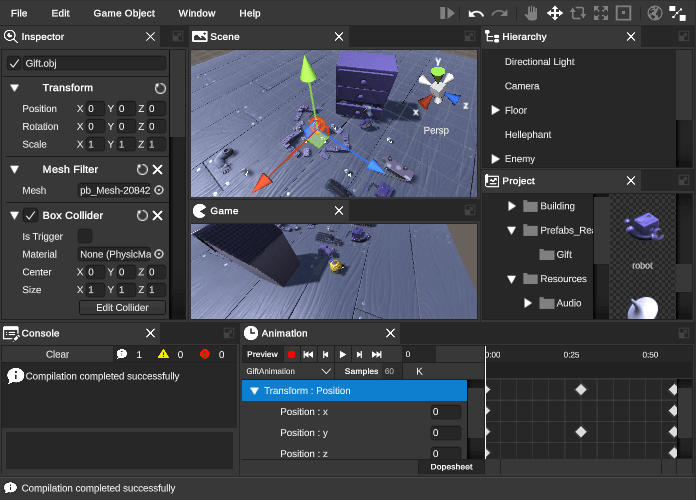

#Runtime Editor Docs
##Overview
<a href="http://u3d.as/v9j" target="_blank"><strong>Runtime Editor</strong></a> is the set of scripts and prefabs which help you to create scene editor, game level editor or build your own modeling application.
It supports [drag & drop](infrastructure.md#drag-and-drop), [undo & redo](infrastructure.md#runtime-undo) and [selection](infrastructure.md#runtime-selection) api.
To implement user interface and core functions runtime editor use [transform-handles](transform-handles.md), [gizmos](gizmos.md), [save load subsystem](save-load.md) and three controls: [menu](menu-control.md), [virtualizing tree view](vtv.md)  and [dock panels](dock-panels.md).
Out of the box it has six Views:
  
  * [Scene View](#scene-view) to manipulate objects in the scene.
  * [Hierarchy View](#hierarchy-view) for displaying and manipulating the object tree.
  * [Project View](#project-view) to manage assets and scenes.
  * [Inspector View](#inspector-view) to display and edit object properties.
  * [Console View](#console-view) to display information, warnings and errors.
  * [Game View](#game-view) for the game.
  * [Add More...](#how-to-add-custom-window-to-window-manager)
  
The Runtime Editor has many ready-to-use [property](#property-editor) and [component](#component-editor) editors and it is relatively easy [to create new ones](#how-to-create-component-editor). __"Add Component"__ drop-down button allows you to add components at runtime.
There are also several important [dialogs](#dialogs) included:
  
  * Save Scene Dialog.
  * Object Picker.
  * [Color Picker](https://github.com/judah4/HSV-Color-Picker-Unity)
  * Asset Bundles and Libraries Importer.
  * Manage Projects Dialog.

##RTEDeps
##Window Manager
##How to: add custom window to Window Manager

!!! note 

    For information on how to create custom window please navigate to this -> [this](infrastructure.md#runtime-window) <- section
     

##Inspector View
##Game Object Editor
##Material Editor
##Component Editor
##Property Editor
##How To: Configure Editors
##How To: Select Component Properties
##How To: Create Component Editor
##How To: Extend Menu
##Hierarchy View
##Project View
##Console View
##Scene View
##Game View
##Dialogs