#Runtime Editor Docs
##Overview
<a href="http://u3d.as/v9j" target="_blank"><strong>Runtime Editor</strong></a> is the set of scripts and prefabs which help you to create scene editor, game level editor or build your own modeling application.
It supports [drag & drop](infrastructure.md#drag-and-drop), [undo & redo](infrastructure.md#runtime-undo) and [selection](infrastructure.md#runtime-selection) api.
To implement user interface and core functions runtime editor use [transform-handles](transform-handles.md), [gizmos](gizmos.md), [save load subsystem](save-load.md) and three controls: [menu](menu-control.md), [virtualizing tree view](vtv.md)  and [dock panels](dock-panels.md).
Out of the box it has six Views:
  
  * __Scene View__ to manipulate objects in the scene.
  * __Hierarchy View__ for displaying and manipulating the object tree.
  * __Project View__ to manage assets and scenes.
  * [Inspector View](#inspector-view) to display and edit object properties.
  * __Console View__ to display information, warnings and errors.
  * __Game View__ for the game.
  * [Add More...](#how-to-add-custom-window-to-window-manager)
  
The Runtime Editor has many ready-to-use property and component editors and it is relatively easy [to create new ones](#how-to-select-component-properties). __"Add Component"__ drop-down button allows you to add components at runtime.
There are also several important dialogs included:
  
  * __Save Scene Dialog__.
  * __Object Picker__.
  * __Color Picker__.
  * __Asset Bundles and Libraries Importer__.
  * __Manage Projects Dialog__.


#Getting Started

To get started with Runtime Editor do following:

1. Create new scene and __save__ it.
2. Click Tools->Runtime Editor->Create

	
	<br/><br/>
	
3. Add Battlehub/RTEditor/Scripts/__Game View Camera__ component to __Main Camera__

	
	<br/><br/>

4. Create several Game Objects and add [__Expose To Editor__](#infrastructure.md#expose-to-editor) component.

	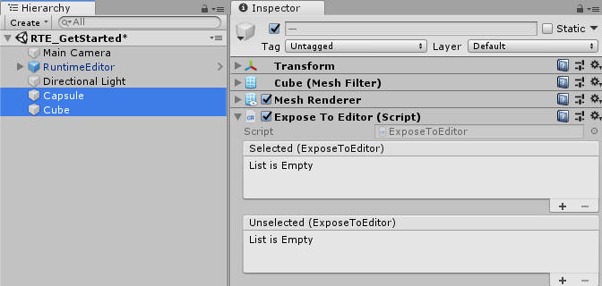
	<br/><br/>
	
5. Click [__Tools->Runtime SaveLoad->Build All__](save-load.md)

	
	<br/><br/>
	
6. Hit Play

	
	<br/><br/>
	

Few more steps:

1. [Create Asset Library](save-load.md#how-to-create-asset-library)
2. Launch runtime editor and click __File->Import Assets__.
	
	
	<br/><br/>
	
3. Select the built-in asset library created in step 1.

	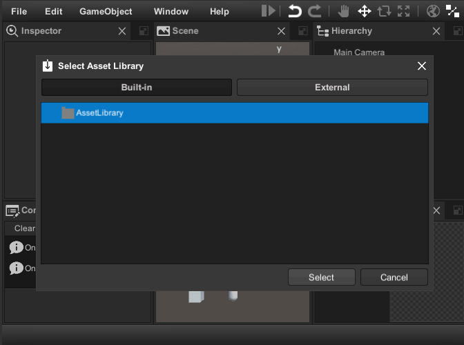
	<br/><br/>

4. Import assets.

	
	<br/><br/>

5. You will see the imported assets in the project window.

	
	<br/><br/>
	
	
!!! note
	Demo scene can be found in __Assets/Battlehub/RTEditor/Demo__
	


##Main & Context Menu

Runtime Editor use [Menu control](menu-control.md) to implement main and context-menu. To extend main menu create static class with __[MenuDefinition]__ attribute and add static methods with __[MenuCommand]__ attribute.

```C#
using Battlehub.RTCommon;
using Battlehub.RTEditor;
using Battlehub.UIControls.MenuControl;
using UnityEngine;

[MenuDefinition]
public static class MyMenu
{
    /// add new command to exising menu
    [MenuCommand("MenuWindow/Create My Window")]
    public static void CreateMyWindow()
    {
        Debug.Log("Create My Window");
    }

    /// add new command to new menu
    [MenuCommand("My Menu/My Submenu/My Command")]
    public static void CreateMyMenu()
    {
        Debug.Log("Create My Menu");
    }

    /// disable menu item
    [MenuCommand("My Menu/My Submenu/My Command", validate: true)]
    public static bool ValidateMyCommand()
    {
        Debug.Log("Disable My Command");
        return false;
    }

    /// replace existing menu item
    [MenuCommand("MenuFile/Close")]
    public static void Close()
    {
        Debug.Log("Intercepted");

        IRuntimeEditor rte = IOC.Resolve<IRuntimeEditor>();
        rte.Close();
    }

    /// Hide existing menu item    
    [MenuCommand("MenuHelp/About RTE", hide: true)]
    public static void HideAbout() { }
}

```
	


To open context menu with custom commands do following:

```C#
using Battlehub.RTCommon;
using Battlehub.RTEditor;
using Battlehub.UIControls.MenuControl;
using UnityEngine;


public static class MyContextMenu
{
    public static void OpenContextMenu()
    {
		IContextMenu contextMenu = IOC.Resolve<IContextMenu>();

		MenuItemInfo cmd1 = new MenuItemInfo { Path = "My Command 1" };
		cmd1.Action = new MenuItemEvent();
		cmd1.Action.AddListener((args) =>
		{
			Debug.Log("Run My Command1");

			IRuntimeEditor editor = IOC.Resolve<IRuntimeEditor>();
			Debug.Log(editor.Selection.activeGameObject);
		});

		MenuItemInfo cmd2 = new MenuItemInfo { Path = "My Command 2" };
		cmd2.Validate = new MenuItemValidationEvent();
		cmd2.Action = new MenuItemEvent();
		cmd2.Validate.AddListener((args) =>
		{
			args.IsValid = false;
		});

		cmd2.Action.AddListener((args) =>
		{
			Debug.Log("Run My Command2");
		});

		contextMenu.Open(new[]
		{
			cmd1, cmd2
		});
	}
}

```


Built-in context menu populated and opened from Assets/Battlehub/RTEditor/Scripts/__ProjectFolderView.cs__ and __ProjectTreeView.cs__


##RTEDeps

The main purpose of the Assets/Battlehub/RTEditor/__RTEDeps.cs__ class is to register various services into [IOC](infrastructure.md#ioc):

* [IResourcePreviewUtility](#resource-preview-utility) - create preview for Game Object or asset.
* [IWindowManager](#window-manager) - manage build-in and custom windows.
* [IContextMenu](#main-context-menu) - create and show context menu.
* __IRuntimeConsole__ - log messages cache.
* [IRuntimeEditor](#iruntimeeditor) - the main interface of the RuntimeEditor.
	
##IRuntimeEditor

IRuntimeEditor inherits the [IRTE interface](infrastructure.md#irte-interface) and adds several important methods and events. 

```C#
using Battlehub.RTCommon;
using Battlehub.RTEditor;
using UnityEngine;

public class GetRuntimeEditor : MonoBehaviour
{
    void Start()
    {
        IRuntimeEditor editor = IOC.Resolve<IRuntimeEditor>();
    }
}

```
Events:

* `event RTEEvent SceneLoading` - fired before loading the scene.
* `event RTEEvent SceneLoaded` - fired after loading the scene.
* `event RTEEvent SceneSaving` - fired before saving the scene.
* `event RTEEvent SceneSaved` - fired before saving the scene.

Methods:

* `void NewScene(bool confirm = true)` - create a new scene (show the confirmation dialog by default).
* `void SaveScene()` - save the current scene. If the scene is new, the save scene dialog will appear.

* `void CreateWindow(string window)` - call corresponding method of  [window manager](#window-manager).
* `void CreateOrActivateWindow(string window)` - this method creates a window only if it does not exist.

* `ProjectAsyncOperation<AssetItem[]> CreatePrefab(ProjectItem folder, ExposeToEditor obj, bool? includeDeps = null)` - create prefab with preview.
* `ProjectAsyncOperation<AssetItem> SaveAsset(UnityObject obj)` - save asset.
* `ProjectAsyncOperation<ProjectItem[]> DeleteAssets(ProjectItem[] projectItems)` - delete assets.
* `ProjectAsyncOperation<AssetItem> UpdatePreview(UnityObject obj)` - update asset preview.

Example:

```C#
using Battlehub.RTCommon;
using Battlehub.RTEditor;
using Battlehub.RTSL.Interface;
using System.Collections;
using UnityEngine;

public class IRuntimeEditorMethodsUsageExample : MonoBehaviour
{
    IEnumerator Start()
    {
		 //Get runtime editor
        IRuntimeEditor editor = IOC.Resolve<IRuntimeEditor>();

        //Use IProject interface if editor is not opened or does not exist. 
        //See save-load/#project for details
        Debug.Assert(editor.IsOpened);

        //Create Prefabs folder
        IProject project = IOC.Resolve<IProject>();
        yield return project.CreateFolder("Prefabs");
        ProjectItem folder = project.GetFolder("Prefabs");

        //Create new object and hide it from hierarchy
        GameObject go = GameObject.CreatePrimitive(PrimitiveType.Sphere);
        go.hideFlags = HideFlags.HideAndDontSave;
        go.SetActive(false);

        //Create prefab with preview and destroy source object 
        yield return editor.CreatePrefab(folder, go.AddComponent<ExposeToEditor>(), true);
        Destroy(go);

        //Load prefab
        ProjectAsyncOperation<Object[]> load = project.Load<GameObject>("Prefabs/Sphere");
        yield return load;
        GameObject loadedGO = load.Result[0] as GameObject;

        //... Make changes

        //Update preview
        yield return editor.UpdatePreview(loadedGO);

        //Save changes
        yield return editor.SaveAsset(loadedGO);

        //Get corresponding project item
        ProjectItem projectItem = project.Get<GameObject>("Prefabs/Sphere");

        //Delete prefab and clear undo stack
        yield return editor.DeleteAssets(new[] { projectItem });
    }
}

```

##Window Manager

Window Manager allows you to create complex windows, such as an inspector or scene, and simple dialogs, such as a message box or confirmation.
The difference between dialog and window is rather subtle. The content of the dialog can be anything, and it can not be docked. To be considered as a window or dialog window, a [Runtime Window](infrastructure.md#runtime-window) component must be attached to the game object.
When the runtime window is activated, the other windows are deactivated. The dialog cannot deactivate the window.

!!! note

	Default windows and dialogs can be found in Assets/Battlehub/RTEditor/__Prefabs__

!!! note

	Window Manager use [dock panels](dock-panels.md) control.

Get window manager:

```C#
using Battlehub.RTCommon;
using Battlehub.RTEditor;
using UnityEngine;

public class GetWindowManager : MonoBehaviour
{
    void Start()
    { 
        IWindowManager wm = IOC.Resolve<IWindowManager>();
    }
}

```

<br/>
Show message box:
```C#
wm.MessageBox("Header", "Text", (sender, args) =>
{
	Debug.Log("OK Click");
});
```

<br/>
Show confirmation:
```C#
wm.Confirmation("Header", "Text",  
	(sender, args) =>
	{
		Debug.Log("Yes click");
	}, 
	(sender, args) =>
	{
		Debug.Log("No click");
	},
	"Yes", "No");
```

<br/>
Activate window:
```C#
wm.ActivateWindow(RuntimeWindowType.Scene.ToString());
```

<br/>
Create window:
```C#
wm.CreateWindow(RuntimeWindowType.Scene.ToString());
```

<br/>
Create dialog window:
```C#
IWindowManager wm = IOC.Resolve<IWindowManager>();
wm.CreateDialogWindow(RuntimeWindowType.Scene.ToString(), "Header",
	(sender, args) => { Debug.Log("OK"); }, 
	(sender, args) => { Debug.Log("Cancel"); });
```

<br/>
Set default layout:
```C#
IWindowManager wm = IOC.Resolve<IWindowManager>();
wm.SetDefaultLayout();
```

##How to: add custom window to Window Manager

!!! note 
    For information on how to create custom window please navigate to this -> [this](infrastructure.md#runtime-window) <- section     
	
1. Create class derived from Runtime Window
2. Duplicate Assets/Battlehub/RTEditor/Prefabs/Views/Resources/__TemplateWindow.prefab__. 
3. Add __CustomWindow__ component created in step 1.
4. Set `Window Type` to _Custom_.

	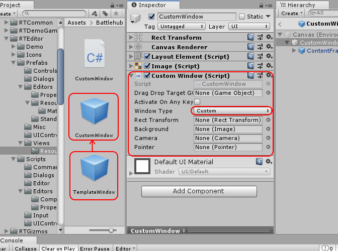
	<br/><br/>
	
5. Create Initialization script and add it to game object in the scene.

```C#
using Battlehub.RTCommon;
using Battlehub.RTEditor;
using Battlehub.UIControls.MenuControl;
using UnityEngine;

[MenuDefinition]
public class Initialization : MonoBehaviour
{
    private IRuntimeEditor m_editor;
    void Start()
    {
        m_editor = IOC.Resolve<IRuntimeEditor>();
        m_editor.IsOpenedChanged += RegisterWindows;
        RegisterWindows();
    }

    void OnDestroy()
    {
        if(m_editor != null)
        {
            m_editor.IsOpenedChanged -= RegisterWindows;
        }
    }

    private void RegisterWindows()
    {
        if (!m_editor.IsOpened)
        {
            return;
        }

        IWindowManager wm = IOC.Resolve<IWindowManager>();
        wm.RegisterWindow(new CustomWindowDescriptor
        {
            IsDialog = false,
            TypeName = "MyWindow",
            Descriptor = new WindowDescriptor
            {
                Header = "My Window",
                MaxWindows = 1,
                Icon = Resources.Load<Sprite>("IconNew"),
                ContentPrefab = Resources.Load<GameObject>("CustomWindow")
            }
        });
    }

    [MenuCommand("MenuWindow/CustomWindow")]
    public static void ShowCustomWindow()
    {
        IWindowManager wm = IOC.Resolve<IWindowManager>();
        wm.CreateWindow("MyWindow");
    }
}
```
	
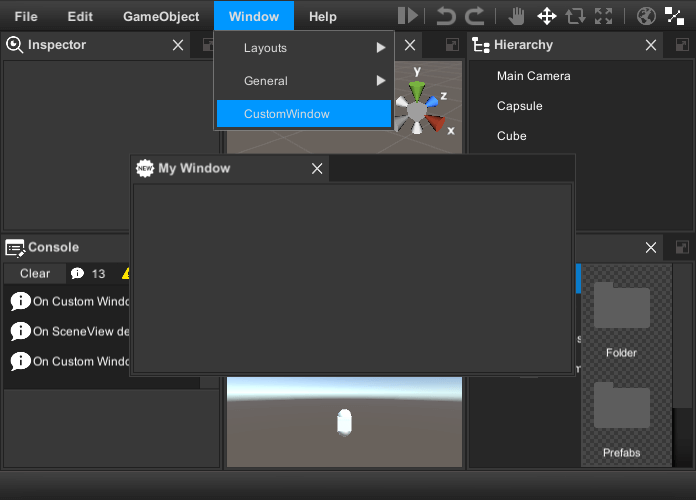

##How to: override default layout

To override default layout do following:

1. Create LayoutOverride script.
2. Modify `DefaultLayout` method.
3. Create game object and add LayoutOverride component.
4. To prevent the game object from being destroyed by [Save & Load](save-load.md) add __RTSLIgnore__ component.


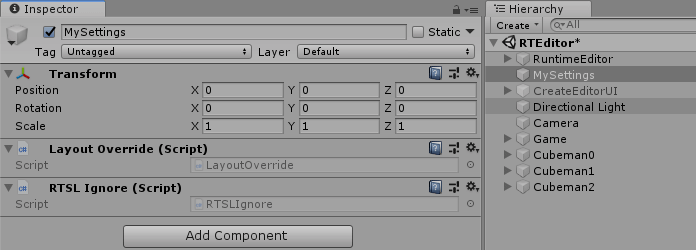

``` C# 
using Battlehub.RTCommon;
using Battlehub.UIControls.DockPanels;
using Battlehub.RTEditor;
using UnityEngine;

public class LayoutOverride : EditorOverride
{
	protected override void OnEditorCreated(object obj)
	{
		OverrideDefaultLayout();
	}

	protected override void OnEditorExist()
	{
		OverrideDefaultLayout();

		IRuntimeEditor editor = IOC.Resolve<IRuntimeEditor>();
		if (editor.IsOpened)
		{
			IWindowManager wm = IOC.Resolve<IWindowManager>();
			wm.SetLayout(DefaultLayout, RuntimeWindowType.Scene.ToString());
		}
	}

	private void OverrideDefaultLayout()
	{
		IWindowManager wm = IOC.Resolve<IWindowManager>();
		wm.OverrideDefaultLayout(DefaultLayout, RuntimeWindowType.Scene.ToString());
	}

	static LayoutInfo DefaultLayout(IWindowManager wm)
	{
		bool isDialog;

		WindowDescriptor sceneWd;
		GameObject sceneContent;
		wm.CreateWindow(RuntimeWindowType.Scene.ToString(), out sceneWd, out sceneContent, out isDialog);

		WindowDescriptor gameWd;
		GameObject gameContent;
		wm.CreateWindow(RuntimeWindowType.Game.ToString(), out gameWd, out gameContent, out isDialog);

		WindowDescriptor inspectorWd;
		GameObject inspectorContent;
		wm.CreateWindow(RuntimeWindowType.Inspector.ToString(), out inspectorWd, out inspectorContent, out isDialog);

		WindowDescriptor hierarchyWd;
		GameObject hierarchyContent;
		wm.CreateWindow(RuntimeWindowType.Hierarchy.ToString(), out hierarchyWd, out hierarchyContent, out isDialog);

		LayoutInfo layout = new LayoutInfo(false,
			new LayoutInfo(
				new LayoutInfo(sceneContent.transform, sceneWd.Header, sceneWd.Icon),
				new LayoutInfo(gameContent.transform, gameWd.Header, gameWd.Icon)),
			new LayoutInfo(true,
				new LayoutInfo(inspectorContent.transform, inspectorWd.Header, inspectorWd.Icon),
				new LayoutInfo(hierarchyContent.transform, hierarchyWd.Header, hierarchyWd.Icon),
				0.5f),
			0.75f);

		return layout;
	}
}
```

You should see following:

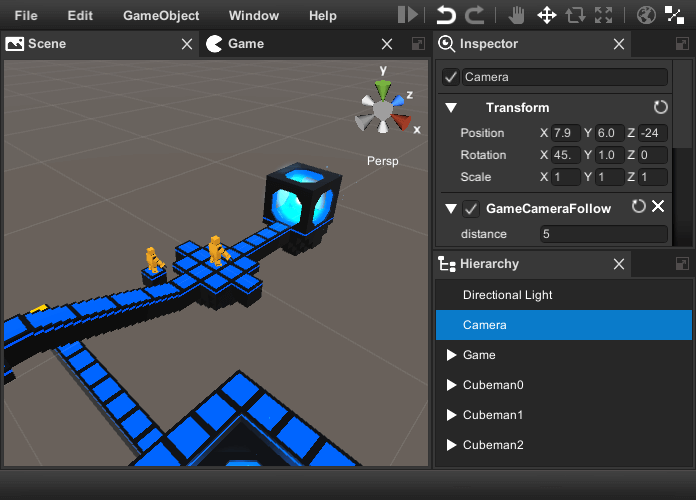

##How to: override scene parameters

To override scene parameters do following:

1. Create SceneParametersOverride script.
2. Implement `OnAfterLayout` event handler.
3. Create game object and add SceneParametersOverride component.
4. To prevent the game object from being destroyed by [Save & Load](save-load.md) add __RTSLIgnore__ component.

``` C# 
using Battlehub.RTCommon;
using Battlehub.RTHandles;
using Battlehub.UIControls.DockPanels;
using Battlehub.RTEditor;
using UnityEngine;

public class SceneParametersOverride : EditorOverride
{
	protected override void OnEditorExist()
	{
		IWindowManager wm = IOC.Resolve<IWindowManager>();
		wm.AfterLayout += OnAfterLayout;
	}

	private void OnAfterLayout(IWindowManager wm)
	{
		wm.AfterLayout -= OnAfterLayout;

		const int windowNumber = 0;
		RuntimeWindow window = wm.GetWindows(RuntimeWindowType.Scene.ToString())[windowNumber].GetComponent<RuntimeWindow>();

		IRuntimeSceneComponent scene = window.IOCContainer.Resolve<IRuntimeSceneComponent>();

		scene.Pivot = new Vector3(5, 0, 0);
		scene.CameraPosition = Vector3.right * 20;
		scene.IsOrthographic = true;

		scene.PositionHandle.GridSize = 2;
		scene.RotationHandle.GridSize = 5;
		scene.SizeOfGrid = 2;

		scene.IsScaleHandleEnabled = false;
		scene.IsSceneGizmoEnabled = false;
		scene.IsBoxSelectionEnabled = false;

		scene.CanSelect = true;
		scene.CanSelectAll = true;

		scene.CanOrbit = true;
		scene.CanPan = false;
		scene.CanZoom = true;

		Tab tab = Region.FindTab(window.transform);
		tab.IsCloseButtonVisible = false;
	}
}

```

##How to: override tools panel

To override tools panel do following:

1. Create ToolsPanelOverride script.
2. Create game object and add ToolsPanelOverride component.
3. Set Tools Prefab field
4. To prevent the game object from being destroyed by [Save & Load](save-load.md) add __RTSLIgnore__ component.

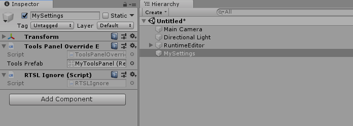

``` C# 
using Battlehub.RTCommon;
using UnityEngine;
using Battlehub.RTEditor;

public class ToolsPanelOverride : EditorOverride
{
	[SerializeField]
	private Transform m_toolsPrefab;

	protected override void OnEditorCreated(object obj)
	{
		OverrideTools();
	}

	protected override void OnEditorExist()
	{
		OverrideTools();

		IRuntimeEditor editor = IOC.Resolve<IRuntimeEditor>();
		if (editor.IsOpened)
		{
			IWindowManager wm = IOC.Resolve<IWindowManager>();
			if (m_toolsPrefab != null)
			{
				wm.SetTools(Instantiate(m_toolsPrefab));
			}
		}
	}

	private void OverrideTools()
	{
		IWindowManager wm = IOC.Resolve<IWindowManager>();
		if (m_toolsPrefab != null)
		{
			wm.OverrideTools(m_toolsPrefab);
		}
	}
}

```

You should see following:


##How to: override ui scale

To override ui scale do following:

1. Create UIScaleOverride script.
2. Create game object and add UIScaleOverride component.
3. Set desired `Scale`
4. To prevent the game object from being destroyed by [Save & Load](save-load.md) add __RTSLIgnore__ component.

```C#
using Battlehub.RTCommon;
using Battlehub.RTHandles;
using Battlehub.RTEditor;
using UnityEngine;


public class UIScaleOverride : EditorOverride
{
	[SerializeField]
	private float Scale = 2;

	protected override void OnEditorExist()
	{
		IRTEAppearance appearance = IOC.Resolve<IRTEAppearance>();
		appearance.UIScaler.scaleFactor = Scale;

		IRuntimeHandlesComponent handles = IOC.Resolve<IRuntimeHandlesComponent>();
		handles.HandleScale = Scale;
		handles.SceneGizmoScale = Scale;
	}
}

```

Before:

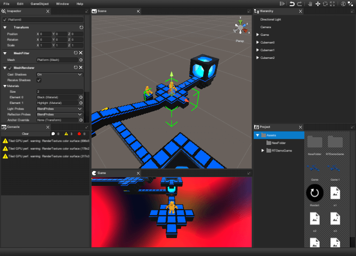

After:

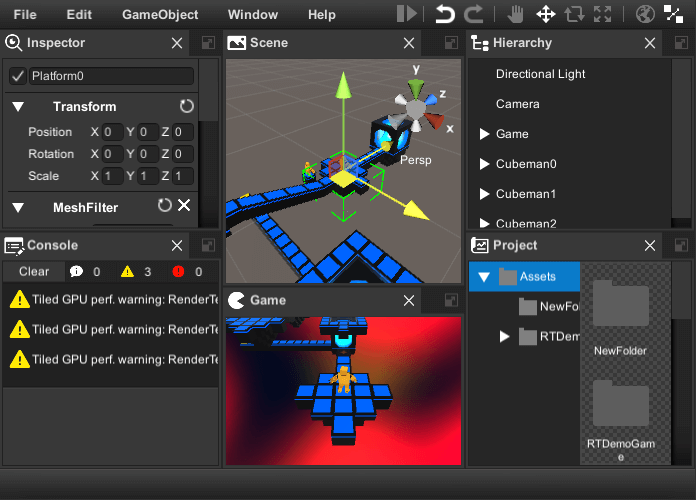

##File Importers

__File importers__ are used during file import procedure to convert external file format to format supported by Runtime Editor. 
For example __.png__ images should be converted to __UnityEngine.Texture2D__ before import. There are two build-in importers:

* PngImporter;
* FastObjImporter;

Built-in importers be found in __Assets\Battlehub\RTEditor\Scripts\Importers__.

FileBrowser with importers can be opened using __File->Import From File__ menu item


To write custom importer do following. Create new script and inherit your class from FileImporter:

```C#
using Battlehub.RTEditor;
using Battlehub.RTCommon;
using Battlehub.RTSL.Interface;
using System.Collections;
using System.IO;
using UnityEngine;

public class JpgImporterExample : FileImporter
{
	public override string FileExt
	{
		get { return ".jpg"; }
	}

	public override string IconPath
	{
		get { return "Importers/Jpg"; }
	}

	public override IEnumerator Import(string filePath, string targetPath)
	{
		byte[] bytes = File.ReadAllBytes(filePath);

		Texture2D texture = new Texture2D(4, 4);
		if (texture.LoadImage(bytes, false))
		{
			IProject project = IOC.Resolve<IProject>();
			IResourcePreviewUtility previewUtility = IOC.Resolve<IResourcePreviewUtility>();
			byte[] preview = previewUtility.CreatePreviewData(texture);
			yield return project.Save(targetPath, texture, preview);
		}
		else
		{
			Debug.LogError("Unable to load image " + filePath);
		}

		Object.Destroy(texture);
	}
}

```

!!! note

    Currently __File Browser__ supported on __Windows__ platform only


##Inspector View

The main purpose of the inspector is to create different editors depending on the type of selected object and its components.
Here is a general idea of what is happening:

* The user selects a Game Object, and the inspector creates a GameObject editor.
* The game object editor creates component editors.
* Each component editor creates property editors.

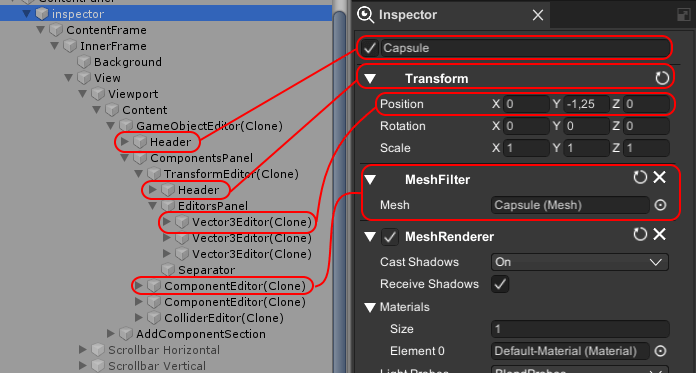

Prefabs:

  * __InspectorView__ can be found in Assets/Battlehub/RTEditor/Prefabs folder,
  * __GameObject__, __Material__ and __Component editors__ in Assets/Battlehub/RTEditor/Prefabs/Editors,
  * __Property editors__ in Assets/Battlehub/RTEditor/Prefabs/Editors/PropertyEditors.


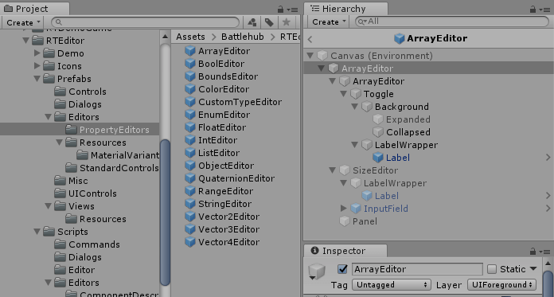

##How To: Configure Editors

To select the editors to be used by the inspector, click __Tools->Runtime Editor->Configuration__

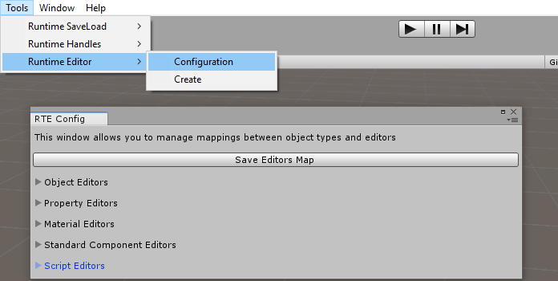

There are five sections in configuration window:

  * __Object Editors__ - select which editor to use for Game Object.
  * __Property Editors__ - select which editors to use for component properties.
  * __Material Editors__ - select which editors to use for materials
  * __Standard Component Editors__ – select which editors to use for standard components.
  * __Script Editors__ – select which editors to use for scripts.
  

After you select and enable the desired component editors, click the __Save Editors Map__ button
 


##How To: Select Component Properties

In order to select the properties displayed by the component editor, you need to create a class and inherit it from __ComponentDescriptorBase<<T>>__.
After that, you need to implement the __GetProperties__ method. It must return __PropertyDescriptors__ for all properties that will be present in the component editor ui.
Here is the example of __TransformComponentDescriptor__:
```C#

using UnityEngine;
using System.Reflection;
using Battlehub.Utils;

namespace Battlehub.RTEditor
{
    public class TransformComponentDescriptor : ComponentDescriptorBase<Transform>
    {
        public override object CreateConverter(ComponentEditor editor)
        {
            TransformPropertyConverter converter = new TransformPropertyConverter();
            converter.Component = (Transform)editor.Component;
            return converter;
        }

        public override PropertyDescriptor[] GetProperties(ComponentEditor editor, object converterObj)
        {
            TransformPropertyConverter converter = (TransformPropertyConverter)converterObj;

            MemberInfo position = Strong.PropertyInfo((Transform x) => x.position);
            MemberInfo rotation = Strong.PropertyInfo((Transform x) => x.rotation);
            MemberInfo rotationConverted = Strong.PropertyInfo((TransformPropertyConverter x) => x.Rotation);
            MemberInfo scale = Strong.PropertyInfo((Transform x) => x.localScale);

            return new[]
                {
                    new PropertyDescriptor( "Position", editor.Component, position) ,
                    new PropertyDescriptor( "Rotation", converter, rotationConverted, rotation),
                    new PropertyDescriptor( "Scale", editor.Component, scale)
                };
        }
    }

    public class TransformPropertyConverter 
    {
        public Vector3 Rotation
        {
            get
            {
                if(Component == null)
                {
                    return Vector3.zero;
                }
                return Component.rotation.eulerAngles;
            }
            set
            {
                if (Component == null)
                {
                    return;
                }
                Component.rotation = Quaternion.Euler(value);
            }
        }

        public Transform Component
        {
            get;
            set;
        }
    }
}

```

__TransformPropertyConverter__ is used to convert a quaternion to Euler angles. This is needed for Vector3Editor to be used instead of QuaternionEditor.

!!! note 

     The remaining built-in component descriptors are in the __Assets/Battlehub/RTEditor/Scripts/Editors/ComponentDescriptors__ folder.
	

##Resource Preview Utility

The resource preview utility is used to create previews for objects. Here is how to used it:

```C#
using Battlehub.RTCommon;
using Battlehub.RTEditor;
using UnityEngine;

public class CreatePreviewExample : MonoBehaviour
{
	[SerializeField]
    Image m_image = null;
	
	Texture2D m_previewTexture;

    void Start()
    {
		m_previewTexture = new Texture2D(1, 1, TextureFormat.ARGB32, true);	

        IResourcePreviewUtility resourcePreviewUtility = IOC.Resolve<IResourcePreviewUtility>();
        byte[] previewData = resourcePreviewUtility.CreatePreviewData(gameObject);
		
		m_previewTexture.LoadImage(assetItem.Preview.PreviewData);
		m_image.sprite = Sprite.Create(m_previewTexture, 
			new Rect(0, 0, m_previewTexture.width, m_previewTexture.height),
			new Vector2(0.5f, 0.5f));
    }
	
	void OnDestroy()
	{		
		if (m_previewTexture != null)
		{
			Destroy(m_previewTexture);
		}
	}
}
```

