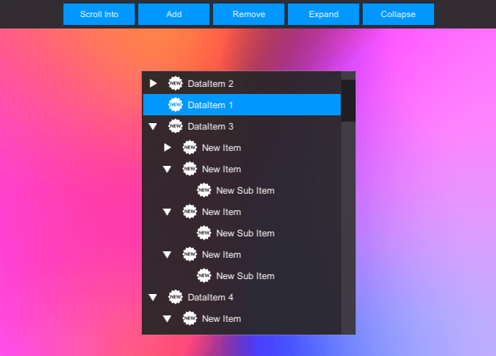
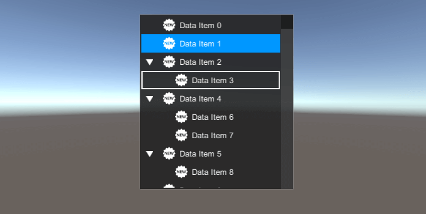
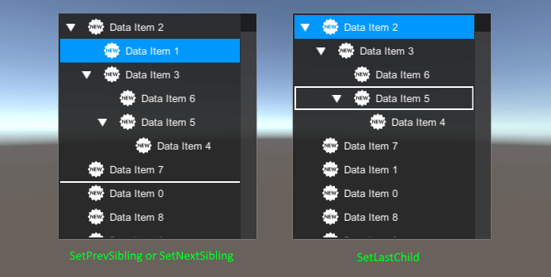
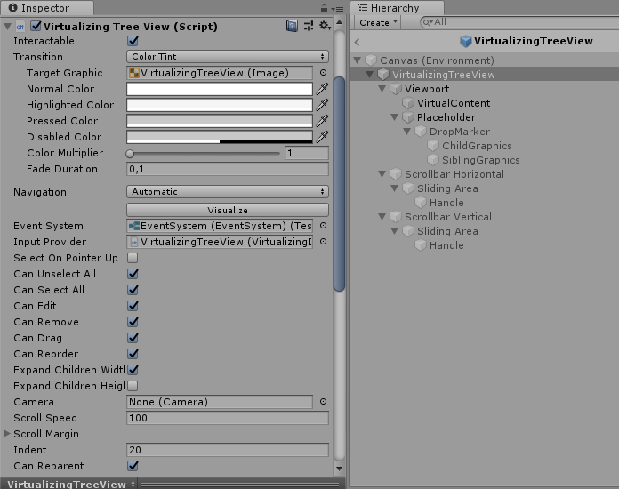
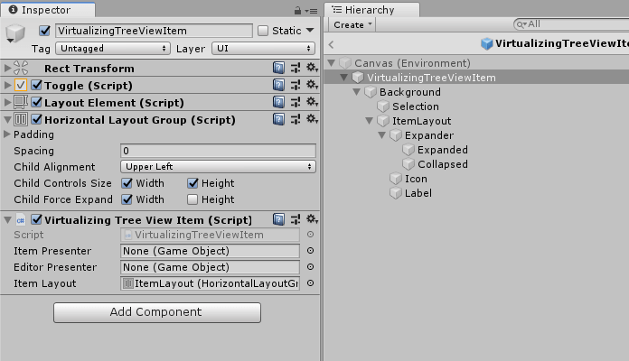

#Virtualizing TreeView Docs
##Overview
The [__Virtualizing Tree View__](#virtualizing-tree-view) is a control that displays a hierarchical data. Virtualzing Tree View implements drag & drop, data binding and selection functions. 
It is highly customizable and can be used to display large collections of data (1000+ items).



##Getting Started

 1. Create Canvas.
 2. Add __VirtualizingTreeView.prefab__ from   
   __Assets/Battlehub/UIControls/VirtualizingTreeView/Prefabs__ to hierarchy.
 3. Create __GettingStarted.cs__ script and add it to __VirtualizingTreeView__ Game Object.
 4. Hit Play.
 
```C#
//GetStarted.cs

using System.Collections.Generic;
using UnityEngine;
using UnityEngine.UI;

using Battlehub.UIControls;

//Example of hierarchical data item
public class ExampleDataItem
{
    public string Name; 
    //... additional fields here ...//
    
    public ExampleDataItem Parent; 
    public List<ExampleDataItem> Children;

    public ExampleDataItem(string name)
    {
        Name = name;
        Children = new List<ExampleDataItem>();
    }

    public override string ToString()
    {
        return Name;
    }
}

public class GetStarted : MonoBehaviour
{
    private VirtualizingTreeView m_treeView;
	
	//root level data items
    private List<ExampleDataItem> m_items; 

    void Start()
    {
        m_treeView = GetComponent<VirtualizingTreeView>();

        //This event fired for each item that becomes visible
        m_treeView.ItemDataBinding += OnItemDataBinding;

        //This event is fired for each expanded item
        m_treeView.ItemExpanding += OnItemExpanding;

        //This event is triggered for each item after drag & drop
        m_treeView.ItemDrop += OnItemDrop;

		//Create data items 
        m_items = new List<ExampleDataItem>();
        for(int i = 0; i < 1000; ++i)
        {
            m_items.Add(new ExampleDataItem("Data Item " + i));
        }

        //Populate tree view with data items
        m_treeView.Items = m_items;
    }

    void OnDestroy()
    {
        if(m_treeView != null)
        {
            m_treeView.ItemDataBinding -= OnItemDataBinding;
            m_treeView.ItemExpanding -= OnItemExpanding;
            m_treeView.ItemDrop -= OnItemDrop;
        }
    }

    void OnItemDataBinding(object sender, VirtualizingTreeViewItemDataBindingArgs e)
    {
        ExampleDataItem item = (ExampleDataItem)e.Item;

        //Get the controls from ItemsPresenter and copy the data into them.
        Text text = e.ItemPresenter.GetComponentInChildren<Text>(true);
        text.text = item.Name;
		
		Image icon = e.ItemPresenter.GetComponentsInChildren<Image>()[4];
        icon.sprite = Resources.Load<Sprite>("IconNew");

        //Notify the tree of the presence of child data items.
        e.HasChildren = item.Children.Count > 0;
    }

    void OnItemExpanding(object sender, VirtualizingItemExpandingArgs e)
    {
        ExampleDataItem item = (ExampleDataItem)e.Item;

        //Return children to the tree view
        e.Children = item.Children;
    }
   
    void OnItemDrop(object sender, ItemDropArgs args)
    {
        if (args.DropTarget == null)
        {
            return;
        }

        //Handle ItemDrop event using standard handler.
        m_treeView.ItemDropStdHandler<ExampleDataItem>(args,
            (item) => item.Parent, 
            (item, parent) => item.Parent = parent,
            (item, parent) => ChildrenOf(parent).IndexOf(item),
            (item, parent) => ChildrenOf(parent).Remove(item),
            (item, parent, i) => ChildrenOf(parent).Insert(i, item));
    }

    List<ExampleDataItem> ChildrenOf(ExampleDataItem parent)
    {
        if (parent == null)
        {
            return m_items; 
        }
        return parent.Children;
    }
}
```

You should see scrollable tree view with data items and drag & drop support:



!!! note

      Full demo can be found in  __Assets/Battelhub/UIControls/VirtualizingTreeView/Demo__ folder

##Virtualizing Scroll Rect

This class reuses "ui containers" to efficiently represent large collections of data elements. UI containers are created for a small visible part of the data elements. 
__VirtualizingScrollRect.cs__ can be found in __Assets/Battlehub/UIControls/VirtualizingTreeView/Scripts/__ folder.

Events: 
 
  * `event DataBindAction ItemDataBinding` - raised when new portion of data become visible .
 
Fields:

  * `Container Prefab` - prefab, which is used to create instances of ui containers for data items.
  * `Virtual Content` - parent of ui containers. 
  
Properties: 
 
  * `IList Items { get; set; }` - gets or sets list of data items.
  * `int ItemsCount{ get; }` -  gets the number of data items.
  * `int Index { get; set; }` - gets or sets index of first visible data item.
  * `int VisibleItemsCount { get; }` - gets the number of currently visible data items.
  
Methods: 
 
  * `bool IsParentOf(Transform child)` -  returns true if the Scroll Rect is the parent of the Transform.
  * `void InsertItem(int index, object item, bool raiseDataBindingEvent = true)` - insert data item.
  * `void RemoveItems(int[] indices, bool raiseItemDataBindingEvent = true)` - remove data items.
  * `RectTransform GetContainer(object obj)` - returns the ui container for data item.
  * `RectTransform FirstContainer()` - returns first the visible ui container.
  * `RectTransform LastContainer()` - returns the last visible ui container.
  * `void ForEachContainer(System.Action<RectTransform> action)` - run action for each ui container.
  * `void SetNextSibling(object sibling, object nextSibling)` - reorder data items and ui containers.
  * `void SetPrevSibling(object sibling, object prevSibling)` - reorder data items and ui containers.
 
##Virtualizing Items Control
This class implements drag and drop, insert, delete, reorder, and triggers many useful events. It also serves as the base class for controls, such as listbox and treeview.  
Implementation can be found in __/Battlehub/UIControls/VirtualizingTreeView/Scripts/__ folder.

Events:
        
 * `event EventHandler<ItemArgs> ItemBeginDrag` - raised on begin drag.
 * `event EventHandler<ItemDropCancelArgs> ItemBeginDrop` - raised on item drop.
 * `event EventHandler<ItemDropCancelArgs> ItemDragEnter` - occurs when the pointer enters a new drop target.
 * `event EventHandler ItemDragExit` - raised when pointer leaves drop area.
 * `event EventHandler<ItemArgs> ItemDrag` - fired while dragging an item.
 * `event EventHandler<ItemDropArgs> ItemDrop` - fired after item dropped.
 * `event EventHandler<ItemArgs> ItemEndDrag` - raised when drag & drop operation completed.
 * `event EventHandler<SelectionChangedArgs> SelectionChanged` - occurs when the selection is changed.
 * `event EventHandler<ItemArgs> ItemDoubleClick` - triggered after double clicking on an item.
 * `event EventHandler<ItemArgs> ItemClick` - triggered after clicking on an item.
 * `event EventHandler<ItemsCancelArgs> ItemsRemoving` - triggered before removing items.
 * `event EventHandler<ItemsRemovedArgs> ItemsRemoved` - triggered after removing items.
 * `event EventHandler IsFocusedChanged` - raised when IsFocused value changed.
 * `event EventHandler Submit` - on submit.
 * `event EventHandler Cancel` - on cancel.
 * `event EventHandler<PointerEventArgs> Click` - triggered after clicking on the tree view.
 * `event EventHandler<PointerEventArgs> PointerEnter` - occurs when the pointer enters the tree view.
 * `event EventHandler<PointerEventArgs> PointerExit` - occurs when the pointer leaves the tree view.
 * `event EventHandler<TDataBindingArgs> ItemDataBinding` - occurs when a new ui container is created or an update is required.
 * `event EventHandler<TDataBindingArgs> ItemBeginEdit` - occurs when the ui container enters edit mode, and the EditorPresenter becomes visible. 	
 * `event EventHandler<TDataBindingArgs> ItemEndEdit`- occurs when the ui container exit edit mode, and the ItemsPresenter becomes visible. 	
 
Fields:

 * `bool SelectOnPointerUp` - select item on pointer up (default: false).
 * `bool CanUnselectAll` - can the user un-select all items? If set to false then at least one item has to be selected (default: true).
 * `bool CanSelectAll` - can the user select all items? (default:true).
 * `bool CanEdit` - can the user edit items? (default: true).
 * `bool CanRemove` - can the user remove items? (default: true).
 * `bool CanDrag` - is drag & drop allowed? (default:true).
 * `bool CanReorder` - Is the reordering of items allowed? (default: true).
 * `float ScrollSpeed` - scrolling sensitivity.
  
Properties:

 * `object DropTarget { get; }` - get currently active drop target.
 * `object[] DragItems { get; }` - get items that are currently dragging.
 * `ItemDropAction DropAction { get; }` - get current drop action:
	 * _None_,
	 * _SetLastChild_,
	 * _SetPrevSilbing_,
	 * _SetNextSibling_.
 * `int SelectedItemsCount { get; }` - get selected data items count.
 * `IEnumerable SelectedItems { get; set; }` - get or set selected data items.
 * `object SelectedItem { get; set; }` - get or set selected data item.
 * `int SelectedIndex { get; set; }` - get or set index of selected data item.
 * `IEnumerable Items { get; set;  }` - data source.
 
Methods:        

 * `int IndexOf(object obj)` - get the index of the data item.
 * `void SetIndex(object obj, int newIndex)` - set index of data item.  
 * `VirtualizingItemContainer GetItemContainer(object item)` - get the visible ui container.
 * `ItemContainerData GetItemContainerData(object item)` - get the state of the ui container.
 * `ItemContainerData Add(object item)` - add data item.
 * `ItemContainerData Insert(int index, object item)` - insert data item.
 * `void Remove(object item)` - remove data item.
 * `void SetNextSibling(object sibling, object nextSibling)` - reorder data items and ui containers.
 * `void SetPrevSibling(object sibling, object prevSibling)` - reorder data items and ui containers.

##Virtualizing Drop Marker
      
The __Virtualizing Drop Marker__ is used to highlight the drop location of the item. Virtualizing Drop Marker can be in one of the states defined in the __ItemDropAction__ enum.

```C#
public enum ItemDropAction      
{         
	None,          
	SetLastChild,          
	SetPrevSibling,          
	SetNextSibling      
}  
```



##Virtualizing Tree View

Structure:



Prefab: __Assets/Battelhub/UIControls/VirtualizingTreeView/Prefabs/VirtualizingTreeView.prefab__.
Script: __Assets/Battelhub/UIControls/VirtualizingTreeView/Scripts/VirtualizingTreeView.cs__.  
Base Class: [__Virtualizing Items Control__](virtualizing-items-control)

Events:

 * `event EventHandler<VirtualizingItemExpandingArgs> ItemExpanding` -     
  triggered before the parent item expands.
 * `event EventHandler<VirtualizingItemCollapsedArgs> ItemCollapsed` -     
  triggered after folding the parent item.

Fields:

 * `bool SelectOnPointerUp` - select item on pointer up (default: false).
 * `bool CanUnselectAll` - If set to false then at least one item has to be selected (default: true).
 * `bool CanSelectAll` - can the user select all items? (default:true).
 * `bool CanEdit` - can the user edit items? (default: true).
 * `bool CanRemove` - can the user remove items? (default: true).
 * `bool CanDrag` - is drag & drop allowed? (default:true).
 * `bool CanReorder` - Is the reordering of items allowed? (default: true).
 * `bool CanReparent` - Is parent change allowed? (default: true).
 * `float ScrollSpeed` - scrolling sensitivity.
 
Methods:

 * `void AddChild(object parent, object item)` - add child item.
 * `void RemoveChild(object parent, object item)` - remove child item.
 * `bool Expand(object item)` - expand item   
    _fails and returns false if the element is not visible and is a descendant of the collapsed parent)_.
 * `void ExpandTo<T>(T item, Func<T,T> getParent)` - expand all ancestors.
 * `void ExpandChildren<T>(T item, Func<T, IEnumerable> getChildren)` - expand all descendants.
 * `void ExpandAll(T item, Func<T,T> getParent, Func<T, IEnumerable> getChildren)` -  
	calls ExpandTo, then ExpandChildren.
 * `void Collapse(object item)` - collapse item.

Examples:

```C#

//Select all root items 

private VirtualizingTreeView m_treeView;

void Start()
{
	m_treeView = GetComponent<VirtualizingTreeView>();

	//..Initialization and data binding...

	m_treeView.SelectionChanged += OnSelectionChanged;
	m_treeView.SelectedItems = m_treeView.Items;
}

void OnDestroy()
{
	if(m_treeView != null)
	{
		m_treeView.SelectionChanged -= OnSelectionChanged;
	}
}

private void OnSelectionChanged(object sender, SelectionChangedArgs e)
{
	if(e.NewItems != null)
	{
		foreach(object item in e.NewItems)
		{
			Debug.Log(item);
		}
	}
}

```

```C#
//Add children and expand selected items
public void Add()
{
	foreach (ExampleDataItem parent in m_treeView.SelectedItems)
	{
		ExampleDataItem item = new ExampleDataItem("New Item");
		parent.Children.Add(item);
		item.Parent = parent;

		m_treeView.AddChild(parent, item);
		m_treeView.Expand(parent);
	}
}
```
 
```C#
//Collapse selected items
public void Collapse()
{
	foreach (DataItem selectedItem in TreeView.SelectedItems)
	{
		TreeView.Collapse(selectedItem);
	}
}
```

```C#
//Expand selected items and their children
public void Expand()
{
	foreach(ExampleDataItem selectedItem in m_treeView.SelectedItems)
	{
		m_treeView.ExpandAll(selectedItem, item => item.Parent, item => item.Children);
	}
}

```

```C#
//Remove selected items
public void Remove()
{
	foreach (ExampleDataItem selectedItem in m_treeView.SelectedItems.OfType<object>().ToArray())
	{
		m_treeView.RemoveChild(selectedItem.Parent, selectedItem);                
	}
}
```

!!! note

      ExampleDataItem is defined in [Getting Started](#getting-started) section.
 

 


##Virtualizing Tree View Item
Structure:




Prefab: __Battelhub/UIControls/VirtualizingTreeView/Prefabs/VirtualizingTreeViewItem.prefab__.
Script: __Battelhub/UIControls/VirtualizingTreeView/Scripts/VirtualizingTreeViewItem.cs__.  

Fields:
 
   * `ItemPresenter` - normal mode ui.
   * `EditorPresenter` - edit mode ui.
   * `ItemLayout` - reference to LayoutElement.
   

